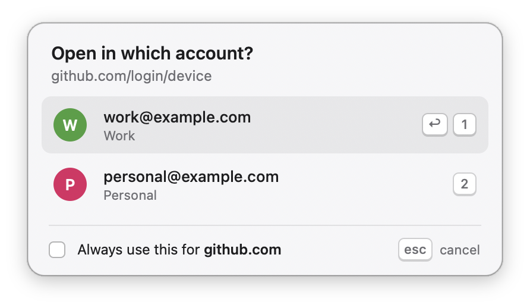

# which-account

A macOS shim that asks **which Chrome account** a link should open in — then remembers the answer.

<picture>
  <source media="(prefers-color-scheme: dark)" srcset="docs/picker-dark.png">
  
</picture>

<sub>Real screenshot. The accounts shown are synthetic — see <a href="#development">Development</a>.</sub>

## The problem

`gcloud auth login`, `gh auth login` and every "click here to authorise" link open in
whatever Chrome profile happens to be in front. If you keep work and personal accounts
in separate profiles, that is the wrong one about half the time — and you only find out
after authenticating as the wrong person.

which-account registers itself as your default browser, looks at each URL as it goes
past, and either routes it silently or asks. Then it hands the URL to your real browser.

## What it does, in order

1. **A rule matches the URL** → open that profile, no dialog.
2. **Your real browser isn't Chromium-family, or has one profile** → hand the URL straight over.
3. **Otherwise** → show the picker.

The picker is the fallback, not the product. Once you have ticked
*Always use this for &lt;host&gt;* on the hosts you use daily, you will rarely see it.

## Install

Needs macOS 13+. No dependencies and no Apple developer account: the app is built on
your machine, so it carries no quarantine flag, and it is ad-hoc signed locally, which
is free. Notarization — the part that costs money — only applies to distributing
prebuilt binaries.

### Homebrew

```sh
brew install wine-fall/tap/which-account
which-account --setup
```

The formula builds from source on your machine, which is what keeps signing and
notarization out of the picture. `--setup` is the step that asks macOS to hand over
`http` and `https`; `which-account --restore` hands it back.

### From source

```sh
git clone https://github.com/wine-fall/which-account.git
cd which-account
make install
```

This needs current Xcode Command Line Tools (`xcode-select --install`). `make install`:

1. builds `.build/release/which-account` and assembles `~/Applications/which-account.app`
   around it (`LSUIElement`, so no Dock icon and no menu bar), then ad-hoc signs the
   bundle — without that, LaunchServices will not accept it as a browser;
2. runs `which-account --setup`, which registers the bundle with LaunchServices, records
   whichever browser is currently your default into the config, and asks macOS to make
   which-account the handler for `http` and `https`.

**macOS will show its own confirmation dialog once, in step 2.** Nothing changes until
you accept it. That is the only time the app touches a system setting. Running
`--setup` again when which-account is already the default does nothing.

If your current browser has no profiles (Safari, Firefox), install still works and tells
you so — every link will simply pass straight through.

### Try it first, without installing

```sh
make release

# print what would happen; open nothing
.build/release/which-account --dry-run https://linear.app/x

# show the real panel; print the choice; open nothing
# (ticking the box still writes the rule, so you can test that too)
.build/release/which-account --show-picker https://linear.app/x

# review the panel in either appearance without flipping your system
.build/release/which-account --show-picker https://linear.app/x --appearance light
```

## Keys

| key | |
|---|---|
| `1`–`9` | open that account immediately |
| `↑` `↓` | move the selection |
| `⏎` | open the selected account |
| `⎋` | close, open nothing |
| click a row | open that account |

The preselected row is Chrome's last-used profile. The checkbox is off by default; ticking
it writes a rule for the URL's host before opening.

## Config

`~/.config/which-account/config.json`, or `$XDG_CONFIG_HOME/which-account/config.json`.
Created on first run.

```json
{
  "_comment": "which-account. 'browser' is the browser URLs are handed to; 'rules' map a host or a URL glob (* wildcard) to a Chrome profile directory.",
  "browser": "com.google.Chrome",
  "rules": [
    { "pattern": "linear.app", "profile": "Profile 3" },
    { "pattern": "github.com/acme/*", "profile": "Profile 3", "_comment": "work org only" },
    { "pattern": "github.com", "profile": "Default" }
  ]
}
```

- **`browser`** — bundle id of your real browser. which-account hands every URL here.
  Recorded at install time; never which-account itself.
- **`profile`** — the profile's *directory* name (`Default`, `Profile 3`), not its display
  name. `--dry-run` prints both, in brackets.
- **`pattern`** — a bare host is matched against the URL's host exactly. A pattern
  containing `*` or `?` is matched as a glob against the whole URL, with and without its
  scheme. Glob rules are checked before host rules, so a hand-written
  `github.com/acme/*` beats a checkbox-written `github.com`.
- `_comment` is preserved anywhere it appears.

Matching is case-insensitive throughout, including paths. URL paths are technically
case-sensitive, so `example.com/Work/*` and `example.com/work/*` cannot select
different profiles — a deliberate trade for rules behaving the way people expect
when they type them.

If the file cannot be parsed it is **not** overwritten: it is moved to
`config.invalid-<timestamp>.json`, a fresh one is written so links keep working, and
the reason is printed. Fix the JSON and move it back.

> **`XDG_CONFIG_HOME` and GUI launches.** macOS launches which-account through
> LaunchServices, which does not see variables exported in your shell. If
> `XDG_CONFIG_HOME` is set only in `.zshrc`, running `which-account` from a terminal
> and clicking a link will read *different* config files. Either leave it unset, or
> set it for the GUI session too (`launchctl setenv XDG_CONFIG_HOME ...`).

Supported browsers: Google Chrome (+ Beta/Dev/Canary), Microsoft Edge, Brave, Chromium,
Vivaldi. Profiles are read from that browser's `Local State`; profiles that are not
signed in are listed too, showing the profile name and *Not signed in*.

## What it deliberately does not do

**Two accounts on one service cannot be told apart automatically.**
`github.com/login/device` and the `accounts.google.com` URL `gcloud` opens carry no
account information at all — there is nothing in the URL to key on. So those hosts ask
every time, unless you pin one with the checkbox. That is the design, not a gap.

Not in v1: rules based on the app that opened the link, rules based on the calling
shell's directory, a `BROWSER_PROFILE=` environment variable, and Firefox/Safari
profiles.

## Uninstall

```sh
which-account --restore          # hand the default browser back first
brew uninstall which-account     # if you installed with Homebrew
```

From a source checkout:

```sh
make uninstall   # hands the default browser back, removes the app, keeps your config
make purge       # the same, and deletes the config directory too
```

Handing the browser back triggers the same one-time macOS confirmation.

If the browser named in your config has been uninstalled, which-account falls back to
Safari and warns you once — never to "the system default", which would be itself.

<a id="development"></a>

## Development

```sh
make build    # debug build
make test     # unit tests
make release  # optimised build
```

The code is in three layers, so that almost all of it is tested without a window,
a GUI session or touching system settings:

| Target | What it holds | Depends on |
|---|---|---|
| `WhichAccountCore` | Local State parsing, config and rules, the routing decision, the picker's keymap — pure functions | Foundation |
| `WhichAccountKit` | Everything the app decides and does: `Router`, the URL queue, `--setup` / `--restore`, launching the browser, argument parsing, `--dry-run` output. LaunchServices, process launching and the default-browser call sit behind protocols | Core |
| `WhichAccountApp` | The real implementations of those protocols (NSWorkspace, `lsregister`), the AppKit panel, `main.swift` | Kit, AppKit |

The tests in `WhichAccountKitTests` swap in fakes for the protocols, so they cover the
paths that matter most and are hardest to exercise by hand — a URL arriving while a
picker is open, a config that names which-account itself, `--setup` run outside the
bundle or unable to record the browser it displaces, a failed hand-off to the browser —
without changing anything on the machine. CI runs the suite on every push.

What is still checked by hand: the panel's rendering and focus behaviour, and the real
system confirmation dialog.

`NSHomeDirectory()` ignores `$HOME`, so `WHICH_ACCOUNT_HOME` points profile discovery
at another directory. Screenshots and manual testing use it, so that neither is ever
produced from a real person's accounts:

```sh
mkdir -p /tmp/demo/Library/Application\ Support/Google/Chrome
cat > /tmp/demo/Library/Application\ Support/Google/Chrome/Local\ State <<'JSON'
{ "profile": { "last_used": "Profile 1", "info_cache": {
    "Default":   { "active_time": 100, "name": "Personal", "user_name": "personal@example.com" },
    "Profile 1": { "active_time": 200, "name": "Work",     "user_name": "work@example.com" } } } }
JSON

WHICH_ACCOUNT_HOME=/tmp/demo .build/release/which-account --show-picker https://github.com/login/device
```

## Licence

MIT.
